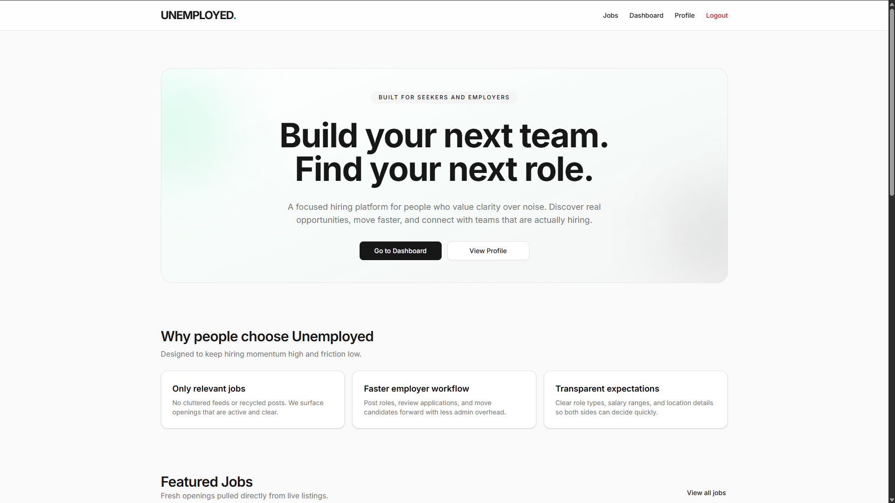

# Unemployed

A Django + Vue fullstack web application for job seekers and employers.

## Features
- Job seekers can register, browse jobs, and apply with resume/cover letter uploads
- Employers can post jobs, view applications, and manage their postings
- Admins (future) can manage users and companies
- RESTful API with JWT authentication (SimpleJWT)
- Frontend built with Vue 3, TypeScript, Pinia, and Vite
- Docker Compose for local development and deployment
- Automated tests for backend and frontend

## Tech Stack
- Backend: Django, Django REST Framework
- Databse: PostgreSQL
- Frontend: Vue 3, TypeScript, Pinia, Vite
- Auth: SimpleJWT
- State: Pinia
- Styling: Tailwind CSS, Shadcn-vue
- Testing: Django TestCase, DRF APIClient, Vitest

